# AI Document Assistant

A Retrieval-Augmented Generation (RAG) chatbot for asking questions about uploaded PDF documents using semantic search and an open-weight language model.

## Features

- PDF upload and page-aware text extraction
- Overlapping text chunking
- Semantic embeddings using Sentence Transformers
- FAISS vector similarity search
- Top-k relevant context retrieval
- Grounded question answering
- GPT-OSS 20B through Groq inference
- Source and page references
- Streamlit chat interface
- Hallucination-aware prompting

## Architecture

```mermaid
%% Generated by https://gitdiagram.com/yash-anpat/ai-document-assistant
flowchart TD

subgraph group_interface["Chat interface"]

  node_chat["Streamlit chat<br/>[app.py]"]

  node_session["Chat session<br/>[app.py]"]

  node_source_view["Source display<br/>[app.py]"]

end

subgraph group_indexing["Document indexing"]

  node_engine["RAG engine<br/>[rag_pipeline.py]"]

  node_pdf_extract["PDF extraction<br/>[rag_pipeline.py]"]

  node_chunking["Text chunking<br/>[rag_pipeline.py]"]

  node_embedding["Semantic embeddings<br/>[rag_pipeline.py]"]

  node_embedding_model["Sentence Transformers"]

  node_chunk_store["Chunk metadata<br/>[rag_pipeline.py]"]

  node_vector_index[("FAISS index<br/>[rag_pipeline.py]")]

end

subgraph group_answering["Question answering"]

  node_retrieval["Similarity retrieval<br/>[rag_pipeline.py]"]

  node_prompt["Grounded prompt<br/>[rag_pipeline.py]"]

  node_groq["Groq inference"]

  node_answer["Answer and sources<br/>[rag_pipeline.py]"]

end

node_user(("User"))

node_user -->|"uploads or asks"| node_chat

node_chat -->|"updates"| node_session

node_chat -->|"builds index"| node_engine

node_engine -->|"extracts pages"| node_pdf_extract

node_engine -->|"splits text"| node_chunking

node_engine -->|"encodes chunks"| node_embedding

node_embedding -->|"encodes text"| node_embedding_model

node_engine -->|"stores chunks"| node_chunk_store

node_engine -->|"adds embeddings"| node_vector_index

node_chat -->|"generates answer"| node_engine

node_engine -->|"retrieves context"| node_retrieval

node_retrieval -->|"encodes query"| node_embedding

node_retrieval -->|"searches vectors"| node_vector_index

node_retrieval -->|"reads chunks"| node_chunk_store

node_engine -->|"builds prompt"| node_prompt

node_prompt -->|"sends context"| node_groq

node_engine -->|"returns response"| node_answer

node_answer -->|"displays answer"| node_chat

node_answer -->|"provides citations"| node_source_view

node_source_view -->|"renders history"| node_session

click node_chat "https://github.com/yash-anpat/ai-document-assistant/blob/main/app.py"

click node_session "https://github.com/yash-anpat/ai-document-assistant/blob/main/app.py"

click node_source_view "https://github.com/yash-anpat/ai-document-assistant/blob/main/app.py"

click node_engine "https://github.com/yash-anpat/ai-document-assistant/blob/main/rag_pipeline.py"

click node_pdf_extract "https://github.com/yash-anpat/ai-document-assistant/blob/main/rag_pipeline.py"

click node_chunking "https://github.com/yash-anpat/ai-document-assistant/blob/main/rag_pipeline.py"

click node_embedding "https://github.com/yash-anpat/ai-document-assistant/blob/main/rag_pipeline.py"

click node_chunk_store "https://github.com/yash-anpat/ai-document-assistant/blob/main/rag_pipeline.py"

click node_vector_index "https://github.com/yash-anpat/ai-document-assistant/blob/main/rag_pipeline.py"

click node_retrieval "https://github.com/yash-anpat/ai-document-assistant/blob/main/rag_pipeline.py"

click node_prompt "https://github.com/yash-anpat/ai-document-assistant/blob/main/rag_pipeline.py"

click node_answer "https://github.com/yash-anpat/ai-document-assistant/blob/main/rag_pipeline.py"

classDef toneNeutral fill:#f8fafc,stroke:#334155,stroke-width:1.5px,color:#0f172a

classDef toneBlue fill:#dbeafe,stroke:#2563eb,stroke-width:1.5px,color:#172554

classDef toneAmber fill:#fef3c7,stroke:#d97706,stroke-width:1.5px,color:#78350f

classDef toneMint fill:#dcfce7,stroke:#16a34a,stroke-width:1.5px,color:#14532d

classDef toneRose fill:#ffe4e6,stroke:#e11d48,stroke-width:1.5px,color:#881337

classDef toneIndigo fill:#e0e7ff,stroke:#4f46e5,stroke-width:1.5px,color:#312e81

classDef toneTeal fill:#ccfbf1,stroke:#0f766e,stroke-width:1.5px,color:#134e4a

class node_chat,node_session,node_source_view,node_user toneBlue

class node_engine,node_pdf_extract,node_chunking,node_embedding,node_embedding_model,node_chunk_store,node_vector_index toneAmber

class node_retrieval,node_prompt,node_groq,node_answer toneMint
```



## RAG Workflow

The application follows a document-grounded question-answering workflow:

1. The user uploads a PDF document through the Streamlit interface.
2. The application extracts text while preserving page information.
3. Extracted text is divided into overlapping chunks.
4. Sentence Transformers converts the chunks into semantic embeddings.
5. The embeddings are stored in a FAISS vector index.
6. When the user asks a question, the query is encoded into the same embedding space.
7. FAISS retrieves the most relevant chunks using vector similarity.
8. The retrieved context is inserted into a grounded prompt.
9. GPT-OSS 20B is used through Groq inference to generate the answer.
10. The application returns the answer together with relevant source and page references.

## Project Structure

```text
ai-document-assistant/
│
├── app.py
├── rag_pipeline.py
├── requirements.txt
├── README.md
├── .gitignore
└── ...
```

### Main Files

| File | Purpose |
|---|---|
| `app.py` | Streamlit user interface, chat session, document upload, and source display |
| `rag_pipeline.py` | PDF processing, chunking, embeddings, FAISS retrieval, prompt construction, and answer generation |
| `requirements.txt` | Python dependencies |

## Core RAG Components

### PDF Processing

Uploaded PDF documents are processed page-by-page so that retrieved chunks can retain their source page information.

### Text Chunking

The extracted document text is split into overlapping chunks. Overlap helps preserve context when relevant information spans chunk boundaries.

### Semantic Embeddings

Sentence Transformers converts both document chunks and user queries into numerical vector representations. This allows retrieval based on semantic similarity rather than exact keyword matching.

### Vector Search

FAISS stores the document embeddings and performs similarity search to retrieve the most relevant chunks for a user query.

### Context Retrieval

The system retrieves the top-k relevant chunks and passes them to the language model as context.

### Grounded Generation

The language model receives the retrieved document context through a grounded prompt. This keeps the generated response tied to the uploaded document rather than relying only on the model's general knowledge.

### Source References

Retrieved chunks retain page/source metadata, allowing the interface to display source and page references alongside the generated answer.

## Model Stack

| Component | Technology |
|---|---|
| Interface | Streamlit |
| PDF processing | Python PDF processing pipeline |
| Embeddings | Sentence Transformers |
| Vector database/index | FAISS |
| Language model | GPT-OSS 20B |
| Inference | Groq |
| Architecture | Retrieval-Augmented Generation |

## Running Locally

### 1. Clone the repository

```bash
git clone https://github.com/yash-anpat/ai-document-assistant.git
cd ai-document-assistant
```

### 2. Create and activate a virtual environment

Windows:

```powershell
python -m venv venv
venv\Scripts\activate
```

Linux/macOS:

```bash
python3 -m venv venv
source venv/bin/activate
```

### 3. Install dependencies

```bash
pip install -r requirements.txt
```

### 4. Configure environment variables

Create a `.env` file and configure the required Groq credentials according to the project's configuration.

Do not commit API keys or other secrets to Git.

### 5. Run the Streamlit application

```bash
streamlit run app.py
```

The application will open in the browser.

## Example Usage

```text
Upload PDF
    ↓
Document indexing
    ↓
Ask a question
    ↓
Semantic retrieval
    ↓
Relevant chunks
    ↓
Grounded prompt
    ↓
GPT-OSS 20B
    ↓
Answer + source/page references
```

## Design Goals

The project focuses on:

- Reducing hallucination by grounding answers in retrieved document context
- Preserving page-level source information
- Using semantic retrieval instead of simple keyword matching
- Keeping the application lightweight and easy to run
- Combining an open-weight language model with a vector retrieval pipeline

## Limitations

- Answer quality depends on the quality and structure of the uploaded PDF.
- Poorly extracted or scanned documents may reduce retrieval quality.
- FAISS retrieval quality depends on the embedding model and chunking strategy.
- The language model can still produce incorrect information if the retrieved context is insufficient or ambiguous.
- The application is designed around PDF document question answering rather than general-purpose web search.

## Repository

[AI Document Assistant — GitHub](https://github.com/yash-anpat/ai-document-assistant)
